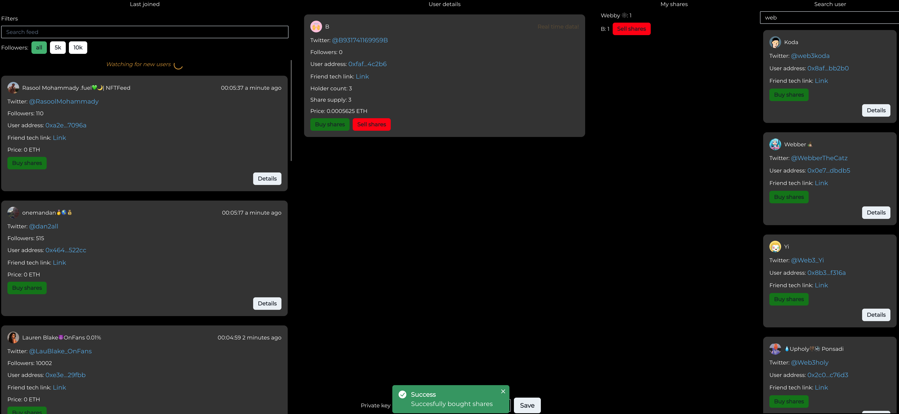

# Friend.tech Terminal

Author: https://twitter.com/webby_the_dev

Discord: https://discord.gg/grmQhZBwWP

Live version: [https://friendtech-terminal.vercel.app/](https://friendtech-terminal.vercel.app/)

Stars highly appreciated ⭐️⭐️⭐️

My friend.tech [link](https://www.friend.tech/rooms/0xFe0a69518CaE0174BF52481545A5c547DD3f252C)

## Screenshot

## Overview

Project was made in few hours because of the friend.tech hype. That is why its code quality isn't the best.

I just wanted to quickly make a simple terminal for getting recent users, buying and selling their keys and fetching some users data.

### Tech stack and libs:

- [Next.js](https://nextjs.org/)
- [Chakra UI](https://chakra-ui.com/)
- [TypeScript](https://www.typescriptlang.org/)
- [Axios](https://axios-http.com/)
- [CORS](https://github.com/expressjs/cors)
- [Ethers.js](https://docs.ethers.io/v5/)
- [Lodash](https://lodash.com/)
- [Moment.js](https://momentjs.com/)

### Possible changes to be made:

- first of all it could have a separated backend that will make all user updates and just pass it through websockets to be fast (also more scalable)
- could change hardcoded private key to metamask for example, minus of it would be that user will have to accept transactions every time which is time consuming
- I don't have much experience with next.js so probably there is a lot of refactors in that aspect
- better UI
- separate index.ts file into more small components (it is too big now)
- make a lot of code refactors (it definitely can work much faster and be better optimized, I just made it fast so didn't pay that much attention to it)
- more error handlers
- my websocket provider was sending duplicated events for some reason so I had to make a process event queue to manage this and do not make multiple duplicated requests
- there are many "tricks" for managing the state and fetching data so it also could be changed or refactored
- more filters could be added, basically it should filter out all fake accounts, bot accounts, OF accounts etc.
- show more tooltips for all of the actions
- code documentation

## Env variables

`NEXT_PUBLIC_FRIEND_TECH_AUTHORIZATION_TOKEN=`: friend.tech token for authorization of `search/users?username=` endpoint

`NEXT_PUBLIC_TWITTER_API_BEARER=`: twitter api bearer for fetching twitter users followers count

`NEXT_PUBLIC_WEBSOCKET_PROVIDER=`: Base network websocket provider

## Running locally

1. Clone the repository.
2. Run `npm install` to install the dependencies.
3. Set up the necessary environment variables by creating `.env.local` file in root folder, copy pasting `.example.env` file content to it and filling all of the variables.
4. Launch the application with `npm run dev`

## License

This project is licensed under the [GNU Affero GPL v3.0](./LICENSE).
